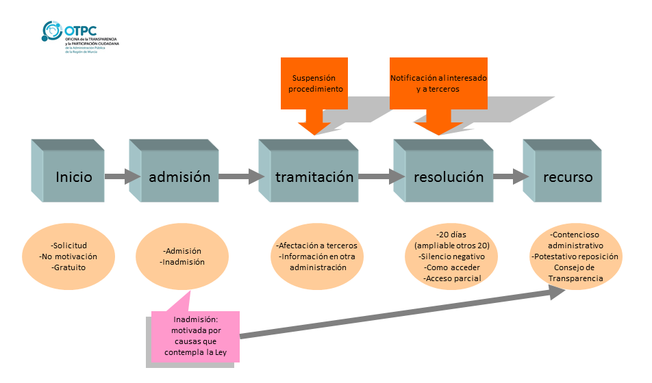
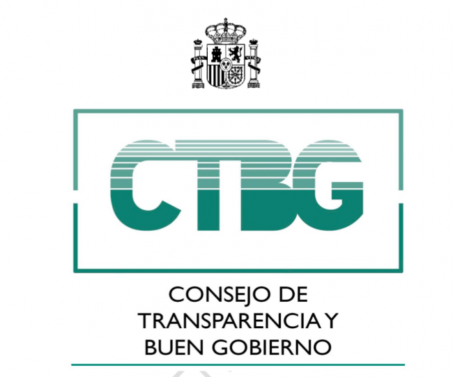
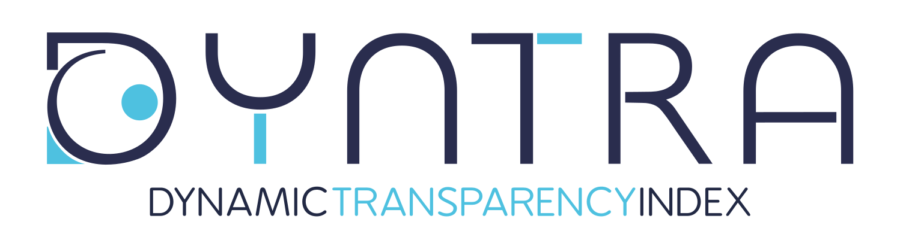
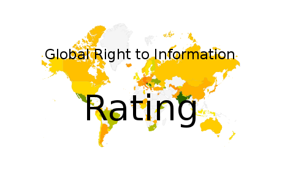

# La ley de Transparencia

Alfredo Sánchez Alberca  
[asalber@gmail.com](asalber@gmail.com)

---

## Fundamentos jurídicos

> [Ley 19/2013, de 9 de diciembre, de transparencia, acceso a la información pública y buen gobierno](https://www.boe.es/buscar/doc.php?id=BOE-A-2013-12887)

----

## Otras leyes

> [Ley 27/2006, de 18 de julio, por la que se regulan los derechos de acceso a la información, de participación pública y de acceso a la justicia en materia de medio ambiente (incorpora las Directivas 2003/4/CE y 2003/35/CE)](https://www.boe.es/buscar/doc.php?id=BOE-A-2006-13010)

> [Ley 37/2007, de 16 de noviembre, sobre reutilización de la información del sector público](https://www.boe.es/diario_boe/txt.php?id=BOE-A-2007-19814)

---

## Aspectos que aborda

- Título I: Transparencia de la actividad pública
  - Capítulo I: Ámbito de aplicación
  - Capítulo II: Publicidad activa
  - Capítulo III: Derecho de acceso a la información pública
- Título II: Buen gobierno
- Título III: Consejo de Transparencia y Buen Gobierno

---

## Ámbito de aplicación (Cap. I)

- Administraciones públicas (estatales, autonómicas y municipales) (AP)
- Seguridad social
- Agencias estatales
- Empresas públicas
- Universidades públicas
- Casa real
- Congreso diputados y Senado
- Tribunal Constitucional y Consejo del Poder Judicial

----

## Ámbito de aplicación

- Banco de España
- Defensor del pueblo
- Tribunal de cuentas
- Consejo Económico y social
- Sociedades mercantiles con participación pública superior al 50%
- Fundaciones del sector público
- Asociaciones constituidas por administraciones, organismos o entidades anteriores.

----

## Sólo obligación de publicidad activa (Art. 3)

- Partidos políticos
- Organizaciones sindicales
- Organizaciones empresariales
- Entidades privadas que reciban durante un año subvenciones públicas superiores a 100.000 euros (o al menos el 40% de sus ingresos).

---

<!-- .slide: data-background="#6699cc" -->
# Publicidad Activa

---

## Publicidad activa (Art. 5)

> Obligación de publicar la información relevante en el ejercicio de sus funciones de forma periódica y actualizada.

- Publicación en la web de manera **clara, estructurada, entendible** y preferiblemente en formatos **reutilizables**.
- La información debe estar siempre actualizada (no más de un mes desde que se produzca la novedad y se publique).

---

## ¿Qué información debe publicarse?

- Información institucional, organizativa y de planificación.
- Información jurídica.
- Información económica, presupuestaria y estadística.

----

### Información institucional, organizativa y de planificación (Art. 6)

- Funciones que se desempeñan.
- Normativa aplicable.
- Estructura organizativa con responsables (perfil y trayectoria profesional).
- AP: Planes de actuación anuales y plurianuales. Objetivos, medios y grado de cumplimiento.

----

### Información jurídica (Art. 7)

- Las directrices, instrucciones, acuerdos y respuestas a consultas particulares (siempre que tengan efectos jurídicos).
- Anteproyectos de ley.
- Proyectos de reglamentos.
- Documentos que deban someterse a información pública por ley.

----

### Información económica, presupuestaria y estadística (Art. 8)

- Todos los contratos (administrativos y privados), con indicación del objeto, duración, el importe de licitación y de adjudicación, el procedimiento utilizado para su celebración, los instrumentos de publicitación, el número de licitadores participantes en el procedimiento y la identidad del adjudicatario, así como las modificaciones del contrato.
La publicación de la información relativa a los contratos menores podrá realizarse trimestralmente.
Asimismo, se publicarán datos estadísticos sobre el porcentaje en volumen
presupuestario de contratos adjudicados a través de cada uno de los procedimientos previstos en la legislación de contratos del sector público.

----

### Información económica, presupuestaria y estadística (Art. 8)

- La relación de los convenios suscritos, con mención de las partes firmantes, su objeto, plazo de duración, modificaciones realizadas, obligados a la realización de las prestaciones y, en su caso, las obligaciones económicas convenidas. Igualmente, se publicarán las encomiendas de gestión que se firmen, con indicación de su objeto, presupuesto, duración, obligaciones económicas y las subcontrataciones que se realicen con mención de los adjudicatarios, procedimiento seguido para la adjudicación e importe de la misma.
- Las subvenciones y ayudas públicas concedidas con indicación de su importe,
objetivo o finalidad y beneficiarios.

----

### Información económica, presupuestaria y estadística (Art. 8)

- Los presupuestos, con descripción de las principales partidas e información actualizada y comprensible sobre su estado de ejecución y sobre el cumplimiento de los objetivos de estabilidad presupuestaria y sostenibilidad financiera de las AP.
- Las cuentas anuales que deban rendirse y los informes de auditoría de cuentas y de fiscalización por parte de los órganos de control externo que sobre ellos se emitan.
- Las retribuciones percibidas anualmente por los altos cargos y máximos
responsables de las entidades.
- Las resoluciones de reconocimiento de compatibilidad de empleados públicos.

----

### Información económica, presupuestaria y estadística (Art. 8)

- Las declaraciones anuales de bienes y actividades de los representantes locales, en los términos previstos en la Ley 7/1985, de 2 de abril, Reguladora de las Bases del Régimen Local.

- La información estadística necesaria para valorar el grado de cumplimiento y calidad de los servicios públicos que sean de su competencia, en los términos que defina cada administración competente.

- Las AP publicarán la relación de inmuebles de su propiedad.

----

### Otra información

- Resoluciones que denieguen el acceso a la información sobre solicitudes de derecho de acceso.

---

<!-- .slide: data-background="#6699cc" -->
# Derecho de Acceso a la Información Pública

---

## Derecho de acceso a la información pública (Art. 12)

> Todas las personas tienen derecho de acceder a la información pública en los términos previstos en el artículo 105.b) de la Constitución Española.

> **Artículo 105.b) de la Constitución Española.**
> La ley regulará el acceso de los ciudadanos a los archivos y registros administrativos, salvo en lo que afecte a la seguridad y defensa del Estado, la averiguación de los delitos y la intimidad de las personas.

---

## Límites al derecho de acceso (Art. 14)

Cuando suponga un perjuicio  para:

- La seguridad nacional.
- La defensa.
- Las relaciones exteriores.
- La seguridad pública.
- La prevención, investigación y sanción de ilícitos.
- La igualdad de las partes en los procesos judiciales.
- Las funciones administrativas de vigilancia, inspección y control.

----

## Límites al derecho de acceso (Art. 14)

- Los intereses económicos y comerciales.
- La política económica y monetaria.
- El secreto profesional y la propiedad intelectual.
- Procesos de toma de decisiones que requieran confidencialidad.
- La protección del medio ambiente.
- La protección de datos personales.

----

## Acceso parcial (Art. 16)

- Cuando sea de aplicación alguno de los límites se concederá el acceso parcial previa omisión de la información afectada por el límite.

- Eliminación de los datos personales que no puedan suministrarse de acuerdo a la [Ley de protección de datos](https://www.boe.es/buscar/doc.php?id=BOE-A-1999-23750)

---

## Solicitud de la información (Art. 17)

- Se podrá realizar por cualquier medio (se recomienda el portal de transparencia).
- No hay obligación justificar la solicitud de acceso a la información,  aunque conviene exponer los motivos para agilizar la respuesta.
- Conviene ser preciso y formal en la información que se solicita.

---

## Causas de inadmisión (Art. 18)

- Información en curso de elaboración.
- Información auxiliar (notas, borradores, informes internos).
- Información que requiera reelaboración.
- Información que no obra en poder del órgano al que se dirige la petición. (_Si se conoce el órgano que tienen la información debe redirigirse la solicitud a este)_.
- Solicitudes repetitivas o abusivas.

---

## Resolución (Art. 20)

- Plazo máximo de un mes + otro mes mes si la información es mucha o compleja.
_¡Ojo! Si pasa más de un mes sin respuesta se entiende que la solicitud ha sido desestimada_.
- Si la información no puede darse en al tiempo que la resolución, deberá darse en un plazo máxido de 10 días desde la resolución.
- Si se deniega o se concede acceso parcial tienen que justificarlo.
- Se puede cobrar una tasa por la expedición de copias.

---

## Recursos (Art. 23 y 24)

- Se puede plantear recurso  contencioso-administrativo.
- Se puede reclamar al Consejo de Transparencia y Buen Gobierno.
- El plazo para reclamar es un mes desde la resolución o desde el día siguiente al que se produzca silencio administrativo.
- El plazo máximo para resolver el recurso será de tres meses. Si no se recibe respuesta, se entenderá desestimado.

---

---

<!-- .slide: data-background="#6699cc" -->
# Buen Gobierno

---

## Buen gobierno

> Principios de conducta afectan a los miembros del Gobiernos, a los Secretarios de Estado y a los altos cargos de las Administraciones Públicas (estatal, autonómicos y municipales).

---

## Infracciones (Art. 29)

- Graves:
  - Incumplimiento reiterado de resolver en plazo.

---

## Sanciones (Art. 30)

- Graves:
  - Declaración de incumplimiento y publicación en el Diario Oficial que corresponda.
  - No percepción de indemnizaciones en el caso de cese del cargo.
- Muy graves:
  - Destitución del cargo.
  - Inhabilitación para puestos de alto cargo entre 5 y 10 años.

----

## Competencia para aplicar las sanciones

- Consejo de ministros cuando se trate de un alto cargo miembro del Gobierno o Secretaría de Estado.
- Ministro de Hacienda cuando se trate de un responsable de la Administración del Estado.
- Consejo de gobierno de la Comunidad Autónoma cuando se trate de un alto cargo de la Comunidad Autónoma.
- Pleno municipal cuando se trate de un alto cargo municipal.

---

<!-- .slide: data-background="#6699cc" -->
# Control de la Transparencia

---

## Consejo de Transparencia y Buen Gobierno (Art. 33 y 34)

> Órgano independiente encargardo de velar por el cumplimiento de la Ley de Transparencia.

---

## Evaluación de la Transparencia

----

## Índice de transparencia municipal

- [Cuestionario para evaluar la transparencia de un ayuntamiento](doc/indice-transparencia-municipal.pdf)

---

## Más información

- [100 preguntas sobre Transparencia](doc/100-preguntas-transparencia.pdf)
- [Acceso de información a través del Portal de Transparencia](doc/acceso-informacion-portal-transparencia.pdf)
